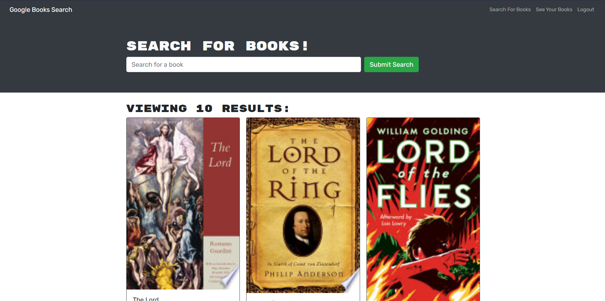

# Challange 21 Book Search Engine

The challenge required students to complete code to create a google book search site that searches books and allows the user to save books on their account.

The app was built using the MERN stack with a React front end, MongoDB database, and Node.js/Express.js server and API.

Contents: MERN STACK, React, Apolloclient, MongoDB, Node.js/Express.js server and API

Link:

Please find attached a snippet screenshot of Challenge 21 below:

My GitHub: [RyanZade](https://github.com/RyanZade)
